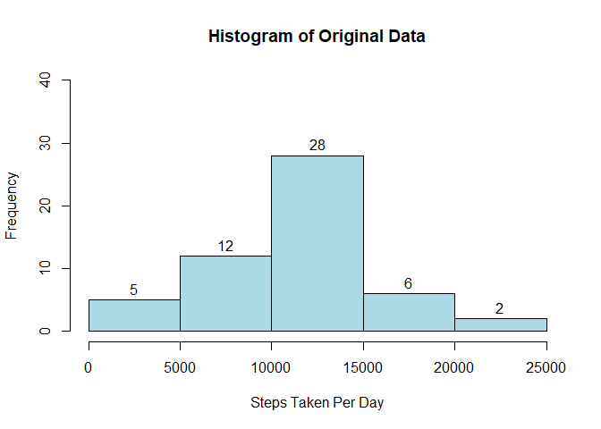
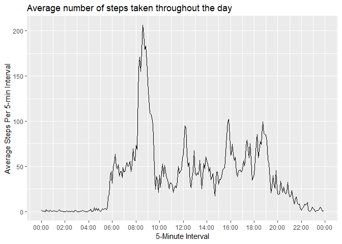
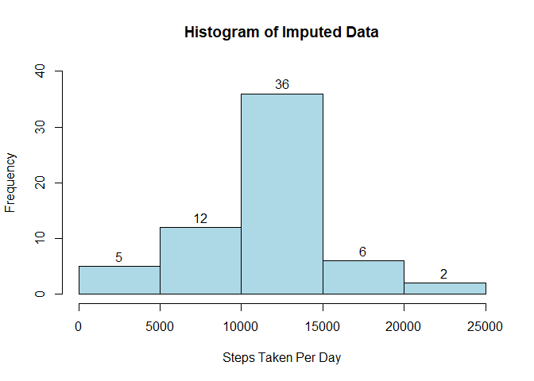
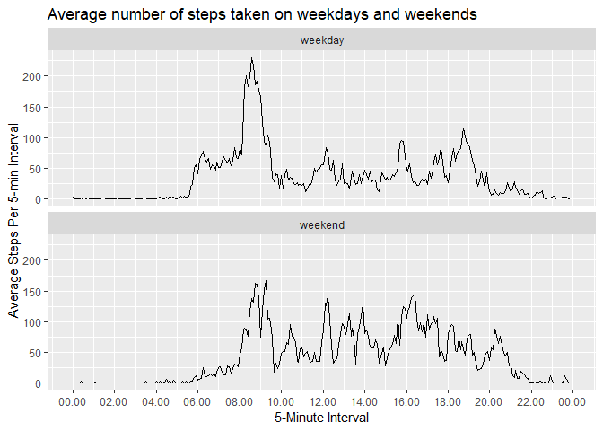

## Instructions

It is now possible to collect a large amount of data about personal movement using activity monitoring devices such as a Fitbit, Nike Fuelband, or Jawbone Up. These type of devices are part of the "quantified self" movement - a group of enthusiasts who take measurements about themselves regularly to improve their health, to find patterns in their behavior, or because they are tech geeks. But these data remain under-utilized both because the raw data are hard to obtain and there is a lack of statistical methods and software for processing and interpreting the data.

This assignment makes use of data from a personal activity monitoring device. This device collects data at 5 minute intervals through out the day. The data consists of two months of data from an anonymous individual collected during the months of October and November, 2012 and include the number of steps taken in 5 minute intervals each day.

### Step One

Provide code for reading in the dataset and/or processing the data.


```r
# attach necessary packages
library(ggplot2)
library(plyr)
library(dplyr)
```

```
## Warning: package 'dplyr' was built under R version 3.5.3
```

```
## 
## Attaching package: 'dplyr'
```

```
## The following objects are masked from 'package:plyr':
## 
##     arrange, count, desc, failwith, id, mutate, rename, summarise,
##     summarize
```

```
## The following objects are masked from 'package:stats':
## 
##     filter, lag
```

```
## The following objects are masked from 'package:base':
## 
##     intersect, setdiff, setequal, union
```

```r
library(lubridate)
```

```
## 
## Attaching package: 'lubridate'
```

```
## The following object is masked from 'package:plyr':
## 
##     here
```

```
## The following object is masked from 'package:base':
## 
##     date
```

```r
library(stringr)
activity<-read.csv('activity.csv',stringsAsFactors=FALSE)
```

### Step Two

Generate a histogram of the total number of steps taken each day.


```r
# sum intervals for each day to get total daily steps
dailyactivity <- activity
dailyactivity$date <- as.Date(dailyactivity$date, "%Y-%m-%d")
dailyactivity <- aggregate(steps ~ date, dailyactivity, sum)
# generate histogram
hist(dailyactivity$steps, main = "Histogram of Original Data", xlab = "Steps Taken Per Day", col = "lightblue", ylim=c(0,40), labels=TRUE)
```

<!-- -->

### Step Three

Calculate the mean and median number of steps taken each day. The mean is 10766.19, and the median is 10765.


```r
# calculate the mean and median total daily steps over the duration of the study
mean(dailyactivity$steps)
```

```
## [1] 10766.19
```

```r
median(dailyactivity$steps)
```

```
## [1] 10765
```

### Step Four

Generate a time series plot of the number of steps taken per 5-minute interval averaged across all days.


```r
# average days for each interval to get average interval steps
intervalactivity <- activity
intervalactivity <- aggregate(steps ~ interval, intervalactivity, mean)
# convert interval into time for graphing
intervalactivity$hour <- intervalactivity$interval%/%100
intervalactivity$minute <- intervalactivity$interval%%100
intervalactivity$time <- paste(intervalactivity$hour,":",intervalactivity$minute,":00",sep="")
intervalactivity$time <- as.POSIXct(intervalactivity$time, format = '%H:%M', tz = 'GMT')
# generate and format line graph
ggplot(intervalactivity, aes(time, steps)) + geom_line() + xlab("5-Minute Interval") + ylab("Average Steps Per 5-min Interval") + scale_x_datetime(date_labels = "%H:%M", date_breaks = "2 hour") + ggtitle("Average number of steps taken throughout the day")
```

<!-- -->

## Step Five

Find the 5-minute interval that, on average, contains the maximum number of steps.The interval is 8:35, and the average number of steps is 206.17.


```r
intervalactivity[which.max(intervalactivity$steps),] %>% mutate(interval = str_replace(interval, "(?=\\d{2}$)", ":"))
```

```
##   interval    steps hour minute                time
## 1     8:35 206.1698    8     35 2020-04-08 08:35:00
```

## Step Six

Write code to describe and show a strategy for imputing missing data. There are 2304 rows of missing data. My strategy for filling in the missing data is to use the mean for that 5-minute interval.


```r
# find number of missing values
sum(is.na(activity$steps))
```

```
## [1] 2304
```

```r
# impute data using the mean for each 5-minute interval
impute.mean <- function(x) replace(x, is.na(x), mean(x, na.rm = TRUE))
imputedactivity <- ddply(activity, ~ interval, transform, steps = impute.mean(steps))
imputedactivity <- imputedactivity[order(imputedactivity$date),]
# spot check to see if imputation worked
head(activity[which(activity$interval == 1210),])
```

```
##      steps       date interval
## 147     NA 2012-10-01     1210
## 435      0 2012-10-02     1210
## 723      0 2012-10-03     1210
## 1011     0 2012-10-04     1210
## 1299   555 2012-10-05     1210
## 1587   519 2012-10-06     1210
```

```r
head(imputedactivity[which(imputedactivity$interval == 1210),])
```

```
##          steps       date interval
## 8907  94.84906 2012-10-01     1210
## 8908   0.00000 2012-10-02     1210
## 8909   0.00000 2012-10-03     1210
## 8910   0.00000 2012-10-04     1210
## 8911 555.00000 2012-10-05     1210
## 8912 519.00000 2012-10-06     1210
```

## Step Seven

Generate a histogram of the total number of steps taken each day after missing values are imputed.


```r
# sum intervals for each day to get total daily steps
dailyimputedactivity <- imputedactivity
dailyimputedactivity$date <- as.Date(dailyimputedactivity$date, "%Y-%m-%d")
dailyimputedactivity <- aggregate(steps ~ date, dailyimputedactivity, sum)
```

The new mean is 10766.19, and the new median is 10766.19. The new mean is the same as the old mean, which makes sense because missing data were replaced with averages. The new median is slightly higher than the old median and equal to the new mean. This also makes sense because there were eight days with no data that had all of their intervals replaced with the same averages.


```r
# calcuate the mean and median total daily steps over the duration of the study
mean(dailyimputedactivity$steps)
```

```
## [1] 10766.19
```

```r
median(dailyimputedactivity$steps)
```

```
## [1] 10766.19
```

```r
# generate histogram
hist(dailyimputedactivity$steps, main = "Histogram of Imputed Data", xlab = "Steps Taken Per Day", col = "lightblue", ylim=c(0,40), labels=TRUE)
```

<!-- -->

## Step Eight

Generate a panel plot comparing the average number of steps taken per 5-minute interval across weekdays and weekends.


```r
# convert dates to days of the week
statusimputedactivity <- imputedactivity
statusimputedactivity$day <- weekdays(as.POSIXct(statusimputedactivity$date))
# subset imputed activity into weekday activity
weekdayimputedactivity <- statusimputedactivity %>% filter(day =="Monday" | day == "Tuesday" | day == "Wednesday" | day == "Thursday" | day == "Friday")
weekdayimputedactivity <- aggregate(steps ~ interval, weekdayimputedactivity, mean)
testweekdayimputedactivity <- weekdayimputedactivity
testweekdayimputedactivity$status <- "weekday"
# subset imputed activity into weekend activity
weekendimputedactivity <- statusimputedactivity %>% filter(day =="Saturday" | day == "Sunday")
weekendimputedactivity <- aggregate(steps ~ interval, weekendimputedactivity, mean)
testweekendimputedactivity <- weekendimputedactivity
testweekendimputedactivity$status <- "weekend"
# merge weekday and weekend activity into one dataframe
stackedactivity <- rbind(testweekdayimputedactivity, testweekendimputedactivity)
# convert interval into time for graphing
stackedactivity$hour <- stackedactivity$interval%/%100
stackedactivity$minute <- stackedactivity$interval%%100
stackedactivity$time <- paste(stackedactivity$hour,":", stackedactivity$minute,":00",sep="")
stackedactivity$time <- as.POSIXct(stackedactivity$time, format = '%H:%M', tz = 'GMT')
# generate and format line graph with panels
ggplot(stackedactivity, aes(time,steps)) + geom_line() + facet_wrap(~status, ncol=1) + xlab("5-Minute Interval") + ylab("Average Steps Per 5-min Interval") + scale_x_datetime(date_labels = "%H:%M", date_breaks = "2 hour") + ggtitle("Average number of steps taken on weekdays and weekends")
```

<!-- -->

## Step Nine

Provide all of the R code needed to reproduce the results (numbers, plots, etc.) in the report. All R code is provided in this Markdown document.
